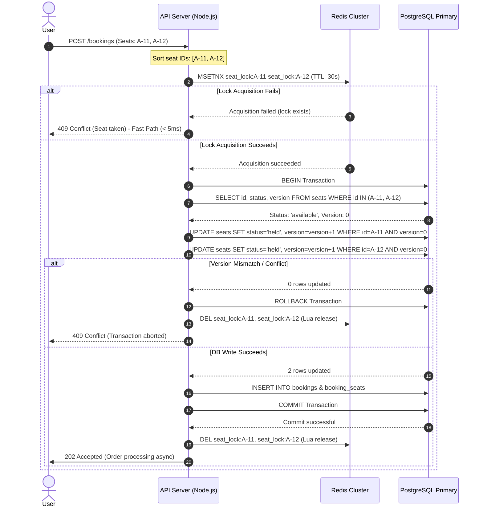

# ShowTime Concurrency Strategy Design

At 12:00:00 noon, 500,000 users click "Book Now" for the same seat layout. Without a solid concurrency strategy, this volume will trigger database deadlocks, connection pool exhaustion, and catastrophic double-bookings. This document analyzes the locking options and justifies ShowTime's chosen concurrency architecture.

---

## Concurrency Options Analysis

### Option A: PostgreSQL Row-Level Locking (`SELECT FOR UPDATE`)

In this model, the API server handles concurrency entirely within PostgreSQL transactions using pessimistic locking:

```sql
BEGIN;

-- 1. Sort and lock specific seat rows to prevent other transactions from reading/writing them
SELECT id, status FROM seats
WHERE id = ANY($1::bigint[]) AND status = 'available'
FOR UPDATE;

-- 2. Transition seats to 'held' status
UPDATE seats 
SET status = 'held',
    held_until = NOW() + INTERVAL '10 minutes',
    held_by = $2
WHERE id = ANY($1::bigint[]);

-- 3. Create a pending booking
INSERT INTO bookings (id, user_id, event_id, status, total_amount)
VALUES ($3, $4, $5, 'pending', $6);

-- 4. Associate seats in junction table
INSERT INTO booking_seats (booking_id, seat_id)
SELECT $3, unnest($1::bigint[]);

COMMIT;
```

#### 1. Connection Pool Exhaustion Math
Traditional RDBMS instances are strictly limited by their connection pools. 
* **Formula**:
  $$\text{Connections Held} = (\% \text{ Non-Payment RPS} \times \text{Avg Query Time (seconds)}) + (\% \text{ Payment RPS} \times \text{Payment Hold Time (seconds)})$$
* **System Inputs**:
  * Max database connections ($C_{\text{max}}$) = `500` (optimized via PgBouncer on RDS `db.r6g.xlarge`)
  * $80\%$ of requests are browsing/selecting seats ($T_{\text{read}} = 20\text{ ms} = 0.02\text{ s}$)
  * $20\%$ of requests are processing payments synchronously ($T_{\text{write}} = 800\text{ ms} = 0.8\text{ s}$)
* **Solving for Pool Exhaustion RPS ($R$)**:
  $$500 = R \times (0.80 \times 0.02 + 0.20 \times 0.80)$$
  $$500 = R \times (0.016 + 0.16)$$
  $$500 = R \times 0.176$$
  $$R = \frac{500}{0.176} \approx 2840.9 \text{ RPS}$$
* **Implication**: At just **2,841 RPS**, the database connection pool exhausts completely. Under a 50,000 RPS peak load, $94\%$ of incoming requests will queue at the pool level, leading to database timeouts, connection drops, and API gateway timeouts (504).

#### 2. Deadlock Risk & Mitigation
* **Risk**: If User 1 tries to book seats `[101, 102]` and User 2 tries to book `[102, 101]` simultaneously, they may lock one seat each and block indefinitely waiting for the other, causing a database deadlock.
* **Mitigation**: The application layer must **always sort seat IDs in ascending order** (e.g., `seats.id` order) before executing the database lock query. This guarantees all transactions acquire locks in the exact same physical sequence, eliminating circular waiting conditions.

---

### Option B: Redis Distributed Lock (`SETNX`)

In this model, concurrency is pushed to an in-memory Redis cluster. The application acquires a temporary lock key before touching the database.

```javascript
// Lock acquisition key structure: seat_lock:{seat_id}
const lockKey = `seat_lock:${seatId}`;
const lockValue = `${userId}:${Date.now()}`;
const lockTTL = 30; // seconds

// 1. Try to acquire seat lock atomically in Redis
const acquired = await redis.set(lockKey, lockValue, 'NX', 'EX', lockTTL);

if (!acquired) {
  return { error: 'SEAT_TEMPORARILY_UNAVAILABLE' };
}

try {
  // 2. Query & update PostgreSQL (now safe from concurrency conflicts)
  const seat = await db.query('SELECT status FROM seats WHERE id = $1', [seatId]);
  if (seat.rows[0].status !== 'available') {
    return { error: 'SEAT_ALREADY_TAKEN' };
  }
  
  await db.query(
    'UPDATE seats SET status = \'held\', held_by = $1, held_until = NOW() + INTERVAL \'10 minutes\' WHERE id = $2',
    [userId, seatId]
  );
  return { success: true };
} finally {
  // 3. Atomically release the lock using Lua script (only if we own it)
  const releaseScript = `
    if redis.call("get", KEYS[1]) == ARGV[1] then
      return redis.call("del", KEYS[1])
    else
      return 0
    end
  `;
  await redis.eval(releaseScript, 1, lockKey, lockValue);
}
```

#### 1. What happens if Redis fails mid-lock?
* **Case 1: Application crashes while holding lock**: The Redis key will automatically expire after its 30-second TTL. The seat becomes unlockable again.
* **Case 2: Redis node crashes and fails over**: If a master node crashes and fails over to an unsynchronized replica, a lock could be lost, allowing a second user to acquire the lock. **However, this does not cause a double-booking** because the SQL schema has a unique constraint on active bookings. The database layer remains the final source of truth.

#### 2. Tradeoffs of Lock TTL (30 seconds)
* **Too Short (< 5 seconds)**: If the database is under load and a write takes 6 seconds, the Redis lock will expire. Another user can acquire the lock and write to the DB, causing a transaction conflict/abort for the first user.
* **Too Long (> 5 minutes)**: If an API server crashes or a user abandons their request before checking out, the seat lock remains active in Redis, preventing legitimate buyers from securing the seat until the TTL expires.
* **Optimal TTL**: **30 seconds** is selected. It covers network jitter and database queue times while releasing abandoned locks quickly.

---

## The Chosen Strategy: Hybrid Locking Architecture

To handle 500,000 concurrent users within a $2,000 monthly budget, ShowTime implements a **Hybrid Locking Strategy**.



### Justification for the Hybrid Strategy

1. **DB Protection (Offloading Load)**: 
   At 12:00:00, the hot path contains thousands of duplicate requests for the same popular seats (e.g., front row center). By wrapping seat-holding attempts in a Redis `MSETNX` lock, **99.9% of duplicate booking requests fail in Redis (in-memory) in under 3ms** without ever reaching the database. The database is protected from lock contention.
2. **ACID Integrity at the Core**: 
   We do not trust Redis as our absolute source of truth. If Redis fails or has a failover delay, the PostgreSQL unique index (`idx_booking_seats_active`) and version-based **Optimistic Concurrency Control (OCC)** prevent double-bookings.
3. **Budget Compliance**: 
   Since Redis filters out the massive write volume, our database write load drops from 50,000 RPS to a few hundred writes/sec. This allows us to use a smaller RDS instance (`db.r6g.xlarge`, costing $262/mo) and a small 3-node Redis cluster (`cache.r6g.large`, costing $359/mo), keeping our total cost under the $2,000/month limit.

### Thresholds for Switching Strategies
We would abandon the Redis distributed lock and fall back to pure database-level locking only if:
1. **Budget falls below $500/month**: We would eliminate ElastiCache and implement pure PostgreSQL optimistic locking, accepting that we must enforce waiting-room queues at the CDN layer to limit throughput to ~1,000 RPS.
2. **Write volume is highly distributed**: If tickets are bought one by one across millions of low-contention events (where lock conflict is near zero), the overhead of Redis locking outweighs its protection value. In that case, direct DB writes with OCC are more efficient.
