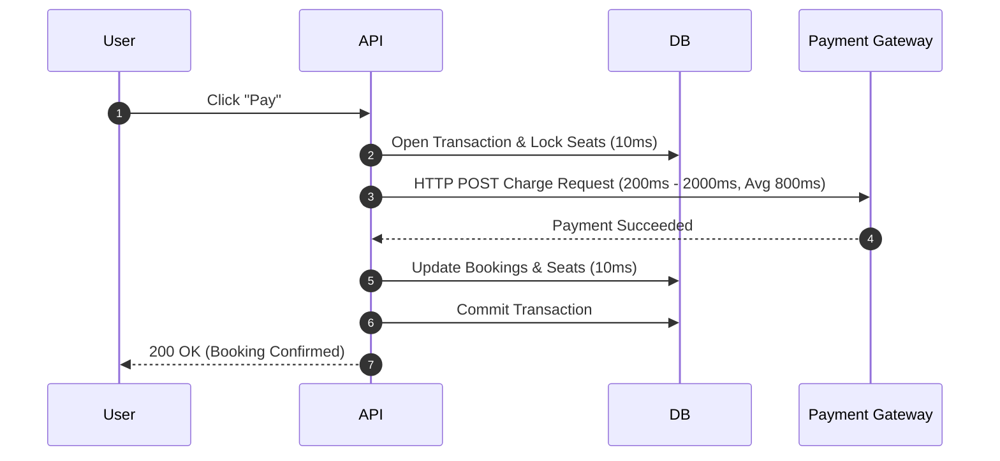
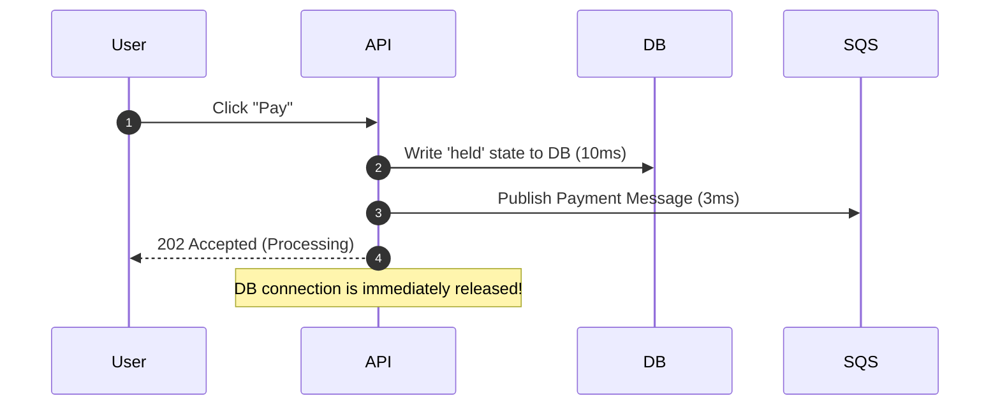
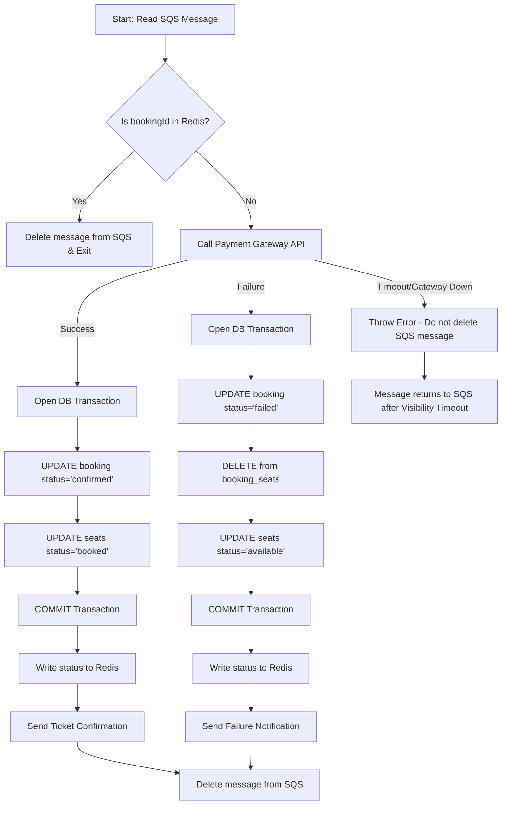

# ShowTime Async Order Processing Queue Design

A synchronous payment flow will collapse the database connection pool within seconds under heavy load. This document describes ShowTime's asynchronous payment architecture, detailing why it is necessary, the SQS message format, the worker processing logic, and key edge case handling.

---

## 1. Why Async? (Database Pool Collapse Math)

### The Synchronous Payment Anti-Pattern
If payment calls were synchronous, the transaction lifecycle would look like this:



In this model, a database connection is held open during the entire **800ms** payment gateway roundtrip.
Using the pool exhaustion formula:

$$\text{Connections Held} = R \times (0.80 \times 0.02 + 0.20 \times 0.80) = R \times 0.176$$

With $C_{\text{max}} = 500$, the system collapses at **2,841 RPS**.

---

### The Asynchronous Queue Solution
By using Amazon SQS to decouple the payment gateway from the database transaction:



The database connection is held for **only 10ms** (for the initial write) instead of waiting for the external gateway.
Recalculating the connection pool limit:

$$\text{Connections Held} = R \times \text{Avg DB Hold Time (seconds)}$$
$$500 = R \times 0.010\text{ s}$$
$$R = 50,000\text{ RPS}$$

**Conclusion**: Async processing increases database throughput capacity from **2,841 RPS to 50,000 RPS (a 17.6x increase)** on the same hardware.

---

## 2. Queue Message Format

The message payload published to SQS must contain all metadata required to process the payment and resolve seat states, avoiding unnecessary database lookups.

```json
{
  "bookingId": "9b1deb4d-3b7d-4bad-9bdd-2b0d7b3dcb6d",
  "userId": "d3b07384-d113-4a6c-9db8-5d2b3b7a5a8f",
  "totalAmount": 450.00,
  "paymentToken": "tok_1N2c34EfG56h7I",
  "seatIds": [101, 102],
  "eventId": 5,
  "idempotencyKey": "idem_booking_9b1deb4d_12345"
}
```

### Field Explanations
* **`bookingId`**: Used to identify and update the target database records in `bookings` and `booking_seats`.
* **`userId`**: User identification to verify ownership and send success/failure notifications.
* **`totalAmount`**: Pre-calculated amount to charge. The worker uses this value directly to call the payment gateway, avoiding a database `SELECT` query.
* **`paymentToken`**: The payment authorization token generated by the payment SDK on the client's device.
* **`seatIds`**: Used to update statuses or release seats directly if a transaction fails.
* **`eventId`**: Used for invalidating seat counts cache and metrics routing.
* **`idempotencyKey`**: A unique hash passed to the payment gateway (e.g., Razorpay/PayU) to guarantee that the user is only charged once, even if the message is processed multiple times due to SQS at-least-once delivery.

---

## 3. Worker Processing Logic

The Payment Worker (running on ECS Fargate) processes messages from the SQS queue.



### Steps:
1. **Idempotency Check**: Check if the `bookingId` exists in Redis (`payment_processed:{bookingId}`). If present, discard the message immediately (prevent duplicate processing).
2. **Execute Gateway Charge**: Call the gateway API using the `paymentToken` and `idempotencyKey`.
3. **Success Path**:
   * Open PostgreSQL transaction.
   * Update `bookings` status to `'confirmed'` and write payment reference.
   * Update status of `seats` to `'booked'`.
   * Commit transaction.
   * Write status to Redis with 24h expiration (`payment_processed:{bookingId} = 'success'`).
   * Trigger ticket generation and notification.
   * Delete message from SQS.
4. **Failure Path (Declined Payment)**:
   * Open PostgreSQL transaction.
   * Update `bookings` status to `'failed'`.
   * Remove corresponding rows from `booking_seats`.
   * Update status of `seats` back to `'available'` and clear `held_until`/`held_by`.
   * Commit transaction.
   * Write status to Redis with 24h expiration (`payment_processed:{bookingId} = 'failed'`).
   * Trigger payment failed notification.
   * Delete message from SQS.
5. **System Failure Path (Database Down / Worker Crashes)**:
   * Do not delete the SQS message.
   * SQS **Visibility Timeout** will expire, returning the message to the queue for another worker to pick up.

---

## 4. Edge Cases Handling

### Edge Case 1: Server crashes after SQS publish but before API responds
* **Problem**: The booking is created, the seats are held, and the SQS message is in the queue, but the user receives a network timeout.
* **Resolution**: The worker processes the payment normally. When the user reloads their app, the client queries `/bookings/{bookingId}/status` (or the booking history endpoint). 
  * If the payment succeeded, the client sees `'confirmed'` and displays the ticket.
  * If it failed, they see `'failed'` and can retry.
  * Idempotency is maintained via the client-side generated UUID.

### Edge Case 2: Payment gateway returns a timeout (Status Unknown)
* **Problem**: The worker receives no response or a 504 from the gateway. The client cannot know if the customer's card was charged.
* **Resolution**: The worker **must not assume failure**.
  1. The worker calls the gateway's **Transaction Query API** using the `idempotencyKey` to verify if a charge was processed.
  2. If the query confirms a successful charge $\rightarrow$ run **Success Path**.
  3. If the query confirms the charge failed $\rightarrow$ run **Failure Path**.
  4. If the query returns "not found" (meaning the request never reached the gateway) $\rightarrow$ run **Failure Path** (or retry).
  5. If the gateway query itself times out $\rightarrow$ the worker throws an error, leaving the message in SQS to retry later.

---

## 5. SQS Configuration Parameters

* **Visibility Timeout**: **30 Seconds**
  * *Justification*: The maximum gateway timeout is set to 15 seconds. 30 seconds ensures a worker has enough time to complete the transaction and query status before the message becomes visible to other workers, preventing double-processing.
* **Max Receive Count (DLQ Threshold)**: **3**
  * *Justification*: If a message fails processing 3 times (e.g., due to a syntax error or a database crash), it is a "poison pill." Moving it to the Dead Letter Queue (DLQ) prevents it from blocking the main queue, while triggering CloudWatch alerts for manual engineering inspection.
