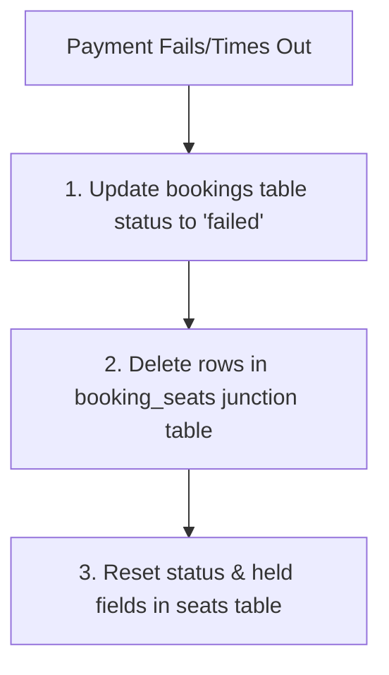

# ShowTime Database Schema Design

This document details the PostgreSQL schema design for the **ShowTime** ticketing application. The design prioritizes referential integrity, performance under load, and prevention of double-booking.

---

## Database Schema DDL

```sql
-- Enable UUID extension
CREATE EXTENSION IF NOT EXISTS "uuid-ossp";

-- 1. Venues Table
CREATE TABLE venues (
    id SERIAL PRIMARY KEY,
    name VARCHAR(255) NOT NULL,
    city VARCHAR(100) NOT NULL,
    capacity INTEGER NOT NULL CHECK (capacity > 0),
    created_at TIMESTAMP WITH TIME ZONE DEFAULT NOW() NOT NULL,
    updated_at TIMESTAMP WITH TIME ZONE DEFAULT NOW() NOT NULL
);

-- 2. Events Table
CREATE TABLE events (
    id SERIAL PRIMARY KEY,
    name VARCHAR(255) NOT NULL,
    venue_id INTEGER NOT NULL REFERENCES venues(id) ON DELETE RESTRICT,
    start_time TIMESTAMP WITH TIME ZONE NOT NULL,
    status VARCHAR(50) NOT NULL DEFAULT 'upcoming' CHECK (status IN ('upcoming', 'on_sale', 'sold_out', 'cancelled')),
    total_seat_count INTEGER NOT NULL CHECK (total_seat_count > 0),
    created_at TIMESTAMP WITH TIME ZONE DEFAULT NOW() NOT NULL,
    updated_at TIMESTAMP WITH TIME ZONE DEFAULT NOW() NOT NULL
);

-- 3. Users Table
CREATE TABLE users (
    id UUID PRIMARY KEY DEFAULT gen_random_uuid(),
    email VARCHAR(255) UNIQUE NOT NULL,
    phone VARCHAR(50) UNIQUE NOT NULL,
    name VARCHAR(100) NOT NULL,
    created_at TIMESTAMP WITH TIME ZONE DEFAULT NOW() NOT NULL,
    updated_at TIMESTAMP WITH TIME ZONE DEFAULT NOW() NOT NULL
);

-- 4. Seats Table (The hot-path concurrency table)
CREATE TABLE seats (
    id BIGSERIAL PRIMARY KEY,
    event_id INTEGER NOT NULL REFERENCES events(id) ON DELETE RESTRICT,
    section VARCHAR(50) NOT NULL,
    row VARCHAR(10) NOT NULL,
    number INTEGER NOT NULL,
    price NUMERIC(10, 2) NOT NULL CHECK (price > 0),
    category VARCHAR(50) NOT NULL CHECK (category IN ('VIP', 'Premium', 'General')),
    status VARCHAR(50) NOT NULL DEFAULT 'available' CHECK (status IN ('available', 'held', 'booked')),
    held_until TIMESTAMP WITH TIME ZONE,
    held_by UUID REFERENCES users(id) ON DELETE SET NULL,
    version INTEGER NOT NULL DEFAULT 0 CHECK (version >= 0),
    created_at TIMESTAMP WITH TIME ZONE DEFAULT NOW() NOT NULL,
    updated_at TIMESTAMP WITH TIME ZONE DEFAULT NOW() NOT NULL,
    
    -- Ensure logical uniqueness of seat position per event
    CONSTRAINT unique_event_seat UNIQUE (event_id, section, row, number)
);

-- 5. Bookings Table
CREATE TABLE bookings (
    id UUID PRIMARY KEY DEFAULT gen_random_uuid(),
    user_id UUID NOT NULL REFERENCES users(id) ON DELETE RESTRICT,
    event_id INTEGER NOT NULL REFERENCES events(id) ON DELETE RESTRICT,
    status VARCHAR(50) NOT NULL DEFAULT 'pending' CHECK (status IN ('pending', 'confirmed', 'failed', 'refunded')),
    total_amount NUMERIC(10, 2) NOT NULL CHECK (total_amount >= 0),
    payment_reference VARCHAR(255),
    created_at TIMESTAMP WITH TIME ZONE DEFAULT NOW() NOT NULL,
    updated_at TIMESTAMP WITH TIME ZONE DEFAULT NOW() NOT NULL
);

-- 6. Booking Seats Junction Table
CREATE TABLE booking_seats (
    booking_id UUID NOT NULL REFERENCES bookings(id) ON DELETE CASCADE,
    seat_id BIGINT NOT NULL REFERENCES seats(id) ON DELETE RESTRICT,
    PRIMARY KEY (booking_id, seat_id)
);
```

---

## Indexing Strategy

To maintain sub-500ms query performance and fast lookup times, the following index structures are implemented:

```sql
-- 1. Optimise seat availability queries & seat hold updates (Hot Path)
CREATE INDEX idx_seats_event_status 
ON seats(event_id, status) 
INCLUDE (held_until, price);
-- Note: INCLUDE stores held_until and price directly in the index page, 
-- enabling Index-Only Scans for availability queries.

-- 2. Optimise user booking history lookups
CREATE INDEX idx_bookings_user 
ON bookings(user_id, created_at DESC);

-- 3. Partial index on bookings for unresolved statuses (pending/failed)
-- This is critical for background workers checking stale bookings.
CREATE INDEX idx_bookings_unresolved 
ON bookings(id) 
WHERE status IN ('pending', 'failed');

-- 4. Unique index on booking_seats for active seat bookings
-- Prevents double-booking at the DB layout level by ensuring a seat cannot 
-- belong to multiple confirmed/pending bookings.
CREATE UNIQUE INDEX idx_booking_seats_active 
ON booking_seats (seat_id);
```

---

## Design Decisions & Commentary

### Why UUID for `user.id` and `booking.id` instead of `SERIAL`?
* **Security & Anti-Enumeration**: Using sequential integers (`SERIAL`) exposes booking volume and makes it easy for competitors or malicious actors to scrape booking details by guessing URLs (e.g., `/bookings/10001`, `/bookings/10002`). UUID v4 provides a randomized 128-bit space that prevents enumeration attacks.
* **Client-Side Generation**: UUIDs can be safely generated client-side by API servers before hitting the database. This allows us to use the UUID as an **idempotency key** for request retries, ensuring that if a network failure occurs, the same booking is not created twice.

### Why does the `seats` table have a `version` column?
* **Optimistic Concurrency Control (OCC)**: The `version` column allows us to run conflict-free updates without blocking reads. When confirming a booking, the query updates the status only if the version matches the read state:
  ```sql
  UPDATE seats 
  SET status = 'booked', version = version + 1 
  WHERE id = $1 AND version = $2;
  ```
  If another process updated the seat first, the version mismatch will result in `0` rows updated, alerting the application to a concurrency conflict immediately without holding database row locks during network IO.

### Why `held_until` on `seats` instead of application-level holding?
* **Single Source of Truth**: Storing the seat reservation state directly in the database ensures that if an API instance crashes, the state is not lost. 
* **Self-Healing Mechanics**: A database timestamp allows a simple, centralized background worker (cron or worker loop) to sweep and free expired holds:
  ```sql
  UPDATE seats 
  SET status = 'available', held_until = NULL, held_by = NULL 
  WHERE status = 'held' AND held_until < NOW();
  ```
  This is clean, robust, and decouples the lock lifecycle from individual API server memory.

### Why a partial index on `bookings.status`?
* **Efficiency at Scale**: 99% of bookings eventually transition to `confirmed` or `refunded`. These are historical records that are rarely updated. A full index on `status` would grow massive and slow down writes.
* **Targeted Queries**: By using `WHERE status IN ('pending', 'failed')`, the index footprint remains extremely small (covering only ~1% or less of active checkout attempts). This provides sub-millisecond lookup speeds for the SQS payment worker and cleanup workers querying unresolved checkouts.

---

## 🧠 Schema Challenge: Handling Payment Failures & Seat Release

### Scenario: A user books 3 seats, and the payment fails halfway.

#### 1. Order of Table Mutations
To roll back the seats and update the booking cleanly, the system executes these mutations in the following order:



1. **`bookings` table**: Update the status from `'pending'` to `'failed'`.
   ```sql
   UPDATE bookings SET status = 'failed', updated_at = NOW() WHERE id = $1;
   ```
2. **`booking_seats` table**: Delete the rows linking this booking to the seats. This releases the unique constraint on `seat_id` for those seats.
   ```sql
   DELETE FROM booking_seats WHERE booking_id = $1;
   ```
3. **`seats` table**: Reset the status of the seats back to `'available'` and clear the metadata.
   ```sql
   UPDATE seats 
   SET status = 'available', held_until = NULL, held_by = NULL, version = version + 1 
   WHERE id = ANY($1::bigint[]) AND held_by = $2;
   ```

#### 2. Ensuring Stale/Abandoned Seats are Released
If the payment fails silently (e.g., user closes the browser or internet drops out), no explicit failure callback is sent. We handle this using two layers:
1. **Application-level TTL (Short-Term)**: Redis lock keys expire automatically after 30 seconds, allowing other users to attempt to lock the seat at the caching layer.
2. **Database Sweep Worker (Long-Term)**: An independent Fargate background worker queries the database every 10 seconds to find expired seat holds:
   ```sql
   WITH expired_holds AS (
       UPDATE seats 
       SET status = 'available', held_until = NULL, held_by = NULL, version = version + 1
       WHERE status = 'held' AND held_until < NOW()
       RETURNING id
   )
   UPDATE bookings 
   SET status = 'failed', updated_at = NOW()
   WHERE id IN (
       SELECT booking_id 
       FROM booking_seats 
       WHERE seat_id IN (SELECT id FROM expired_holds)
   );
   ```
   This dual-layer recovery ensures that no seat remains locked indefinitely due to network or client failures.
